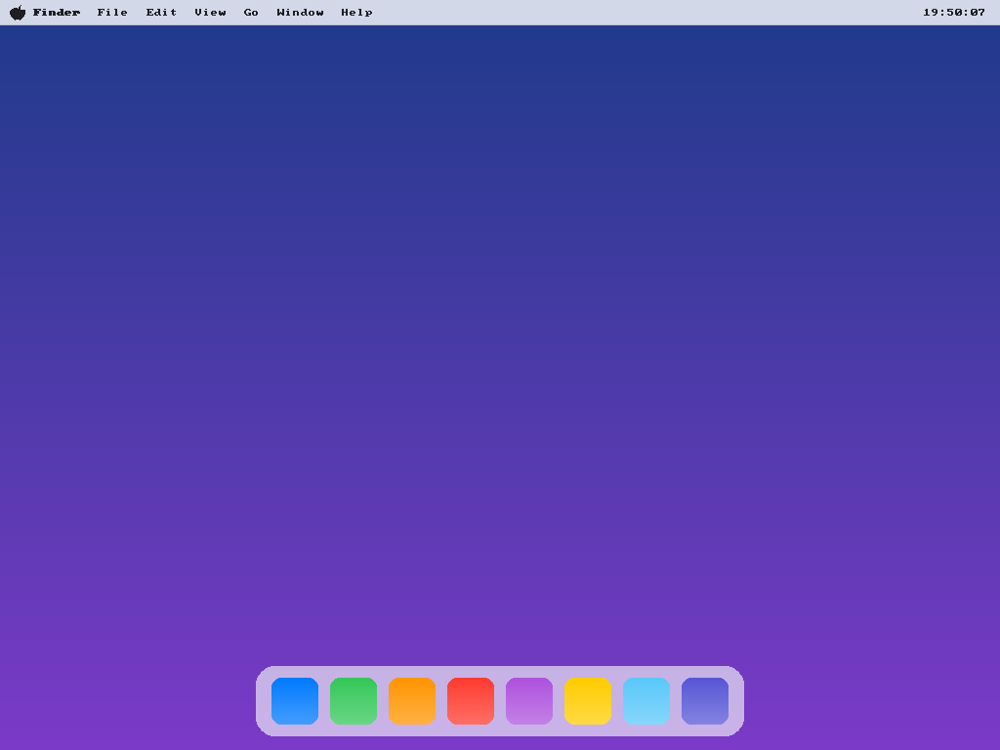

# AquaOS — a from-scratch, macOS-style OS for VirtualBox

AquaOS is a tiny operating system written **from scratch** (its own kernel in
C + x86 assembly, its own bootable ISO) that boots in VirtualBox / QEMU and
paints a **macOS Sonoma-style desktop** straight to the graphics framebuffer:

- a smooth blue → violet gradient wallpaper
- a top menu bar with the Apple logo, menu titles, and a **live clock** that
  ticks every second (read from the CMOS real-time clock)
- a frosted dock with rounded, glossy gradient app icons

There is **no Linux, BSD, or macOS base** under it — the bootloader (GRUB) only
chain-loads our own 32-bit kernel, which does everything else itself.



> **Note on the name.** This is *not* Apple macOS and contains none of Apple's
> software. macOS is proprietary and licensed only for Apple hardware, so this
> project is an original, macOS-*styled* desktop rendered by our own code. The
> Apple logo glyph is a hand-drawn approximation for visual flavor.

## What's inside

| File | Purpose |
|------|---------|
| `src/boot.asm` | Multiboot2 header + 32-bit entry point; sets up the stack and calls the C kernel. |
| `src/kernel.c` | The kernel: finds the framebuffer from the Multiboot2 info, then draws the wallpaper, menu bar, dock, and live clock. |
| `src/font8x8.h` | Public-domain 8×8 bitmap font for on-screen text. |
| `linker.ld` | Links the kernel at 1 MiB with the Multiboot2 header first. |
| `grub/grub.cfg` | GRUB menu entry baked into the ISO. |
| `Makefile` | Builds the kernel and the bootable ISO. |

## Building the ISO

You need a Linux host (or WSL) with these tools:

```bash
sudo apt-get install build-essential nasm grub-pc-bin grub-common xorriso mtools
# optional, for `make run`:
sudo apt-get install qemu-system-x86
```

Then:

```bash
make            # produces build/aquaos.iso
```

## Running it

### QEMU (quickest)

```bash
make run
```

### VirtualBox

1. **Machine ▸ New** — Name: `AquaOS`, Type: **Other**, Version: **Other/Unknown**.
2. Memory: 256 MB is plenty. You do **not** need a virtual hard disk.
3. After creating it: **Settings ▸ Storage**, select the optical drive, and
   attach `build/aquaos.iso`.
4. **Settings ▸ Display** — make sure the graphics controller is **VBoxVGA**
   or **VMSVGA** (so GRUB can set the 1024×768×32 framebuffer the kernel asks
   for).
5. **Start** the VM. GRUB boots straight into AquaOS and the desktop appears.

> AquaOS requests a 1024×768 32-bpp framebuffer via the Multiboot2 framebuffer
> tag. If a firmware/emulator can't provide a 32-bpp linear framebuffer, the
> kernel halts safely rather than drawing garbage.

## How it works (high level)

1. **GRUB** sees the Multiboot2 header in `boot.asm`, loads `kernel.elf` at
   1 MiB, switches to a graphics mode, and jumps to `_start` in 32-bit
   protected mode with a pointer to the Multiboot2 info structure.
2. `_start` sets up a stack and calls `kmain(magic, mbi)`.
3. `kmain` walks the Multiboot2 tags to find the **framebuffer** tag (address,
   pitch, width, height, bpp), then composites the desktop using simple
   software rendering: gradients, alpha blending, rounded rectangles, and an
   8×8 scaled font.
4. A small loop reads the **CMOS RTC** over ports `0x70/0x71` and redraws the
   clock whenever the second changes.

## Ideas for extending it

- Keyboard input (PS/2) to open a fake "window" when an icon is clicked.
- A PIT timer + IDT for real interrupt-driven timing instead of the poll loop.
- Mouse cursor and dock hover magnification.
- Anti-aliased fonts and a real wallpaper image decoder.
